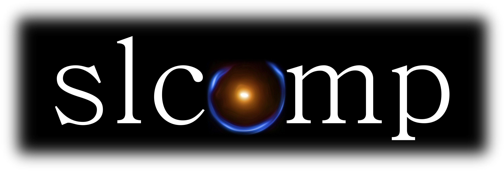
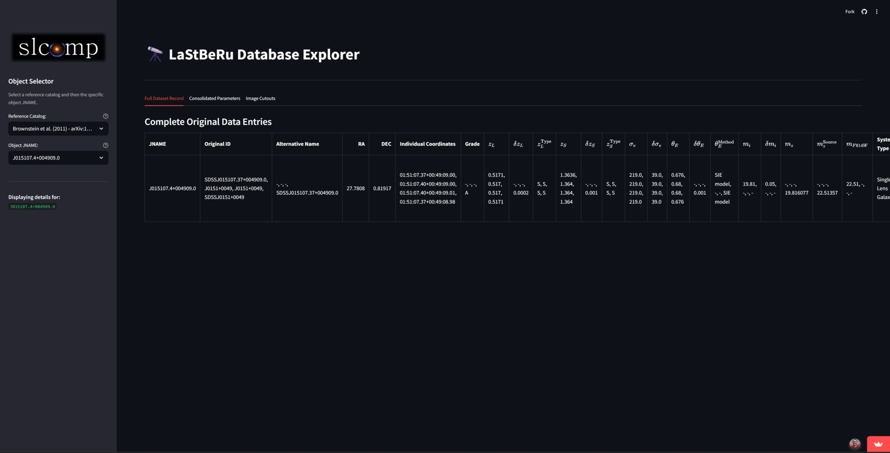
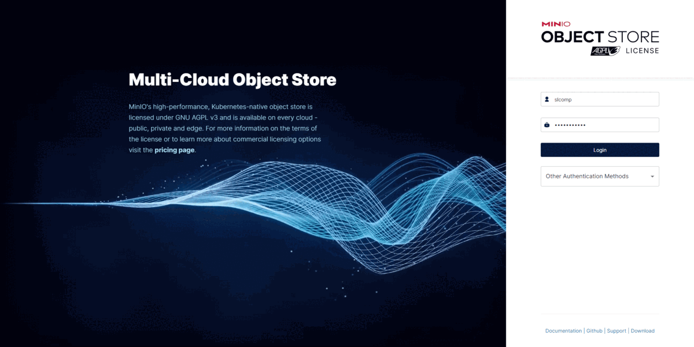

  

# slcomp: Strong Gravitational Lensing Compilation

`slcomp` is a compilation of strong gravitational lensing candidates. It provides tabular data, raw `FITS` image cutouts, and processed color images from multiple wide-field surveys. This dataset is intended for astrophysical research, including statistical studies, preparation for upcoming surveys (e.g., Rubin LSST), machine learning model training, and planning follow-up observations.

**📄 Citation & Further Details:**
For a comprehensive description of the compilation, data processing, and scientific applications, please refer to our accompanying paper:
* **arXiv:** [Link to Your Paper on arXiv (e.g., arxiv.org/abs/YYMM.XXXXX)] (_In preparation_)

## Key Contents

* **Large Catalog:** Data on thousands of strong lensing candidates from literature and surveys.
* **Homogenized Tabular Data:** Includes redshifts, magnitudes, Einstein radii, and velocity dispersions where available.
* **Image Archive:**
    * Raw `FITS` cutouts in multiple bands ($20^{\prime\prime}$ and $4^{\prime}$ sizes).
    * Processed RGB color images.
* **Cross-Matched Information:** Data enhanced through cross-matching with major photometric and spectroscopic surveys.

## Explore Data via Dashboard

Use the interactive dashboard to select and view systems.

  

➡️ **[Dashboard Link](https://YOUR_STABLE_DASHBOARD_LINK_HERE)**
Filter by `JNAME` or reference and inspect image cutouts.

## Download Data

Tabular data and processed image cutouts are available for download.

  

➡️ **[MinIO Service Link](https://df69-152-84-248-250.ngrok-free.app/login)**
**Instructions & Examples:**
* Data access instructions: **[Data Access Notebook](./notebooks/how_to.ipynb)**.
* Additional example notebooks (database exploration, proposal planning): `notebooks/` folder, including **[Proposal Planning Notebook](./notebooks/proposals/proposals.ipynb)**.

## Support

* **Contact:** For credentials or support, email [fisica.renan@gmail.com](mailto:fisica.renan@gmail.com).
* **Community:** Join the `CosmoObs Slack channel`.

## Acknowledgements

This study was financed in part by the Coordenação de Aperfeiçoamento de Pessoal de Nível Superior – Brasil (CAPES) – Finance Code 001 and by the Conselho Nacional de Desenvolvimento Científico e Tecnológico (CNPq) - Finance Code 140210/2021-0.
