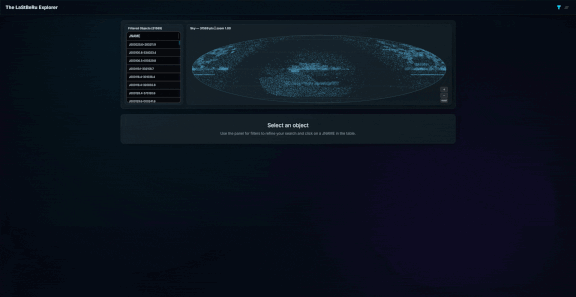

<p align="center">
  
</p>

# slcomp: Strong Gravitational Lensing Compilation

`slcomp` is a compilation of strong gravitational lensing systems. It provides tabular data, raw `FITS` image cutouts, and processed color images from multiple wide-field surveys. This dataset is intended for astrophysical research, including statistical studies, preparation for upcoming surveys (e.g., Rubin LSST), machine learning model training, and planning follow-up observations.

**📄 Citation & Further Details:**
For a comprehensive description of the compilation, data processing, and scientific applications, please refer to:

```bibtex
  @article{lastberu,
    title        = {{The Last Stand Before Rubin: a consolidated sample of strong lensing systems in wide-field surveys}},
    author       = {{Alves de Oliveira}, Renan and {França}, João P. C. and {Makler}, Martín},
    year         = 2025,
    month        = sep,
    journal      = "arXiv e-prints",
    doi          = "10.48550/arXiv.2509.09798",
    keywords     = "Astronomical Databases: Miscellaneous, Gravitational Lensing: Strong, Catalogues, Surveys",
    eid          = "arXiv:2509.09798",
    archiveprefix = "arXiv",
    eprint       = "2509.09798",
    primaryclass = "astro-ph.GA",
    url       = "https://arxiv.org/abs/2509.09798"
  }
```

```bibtex
  @phdthesis{Oliveira:2024,
      author = "Alves de Oliveira, Renan",
      title = "Probing cosmology with an eye on Rubin : from strong lensing to the large scale structure of the universe",
      school = "Universidade Federal do Espírito Santo",
      year = 2024,
      month = apr,
      url = "https://arxiv.org/abs/2509.09798"
  }
```

[](https://creativecommons.org/licenses/by-nc/4.0/)

## Key Contents

* **Large Catalog:** Data on thousands of strong lensing candidates from literature and surveys.
* **Homogenized Tabular Data:** Includes redshifts, magnitudes, Einstein radii, and velocity dispersions where available.
* **Image Archive:**
    * Raw `FITS` cutouts in multiple bands ($20^{\prime\prime}$ and $4^{\prime}$ sizes).
    * Processed RGB color images.
* **Cross-Matched Information:** Data enhanced through cross-matching with major photometric and spectroscopic surveys.

## Explore Data via Dashboard

Use the interactive dashboard to select and view systems.
<p align="center">
  
</p>

➡️ **[Dashboard Link](https://cosmoobs.github.io/slcomp)**
Filter by `JNAME` or reference and inspect image cutouts.

## Download Data

Tabular data and processed image cutouts are available for download.
<p align="center">
  
</p>

➡️ **[MinIO Service Link](https://3t611xfvhvp2.share.zrok.io)**
**Instructions & Examples:**
* Data access instructions: **[Data Access Notebook](./notebooks/how_to.ipynb)**.
* Additional example notebooks (database exploration, proposal planning): `notebooks/` folder, including **[Proposal Planning Notebook](./notebooks/proposals/proposals.ipynb)**.

## Support

* **Contact:** For credentials or support, email [fisica.renan@gmail.com](mailto:fisica.renan@gmail.com).
* **Community:** Join the `CosmoObs Slack channel`.

## Acknowledgements

- This study was financed in part by:
  - Coordenação de Aperfeiçoamento de Pessoal de Nível Superior (CAPES) - Brasil (Finance Code 001)
  - Conselho Nacional de Desenvolvimento Científico e Tecnológico (CNPq) - Brasil (Finance Code 140210/2021-0 and 316239/2023-2)
  - AGENCIA I+D+i - Argentina (project PICT-2021-GRF-TI-00816)
  - State of Rio de Janeiro (FAPERJ - E-26/202.687/2019 and E-26/210.079/2020)
- The developers of Python (including standard libraries: argparse, collections, gc, getpass, glob, io, itertools, json, multiprocessing, os, pathlib, re, requests, shutil, subprocess, sys, urllib, warnings), Astropy, Cython, emcee, GetDist, healpy, Joblib, matplotlib_venn, Matplotlib, MOCPy, NumPy, pandarallel, pandas, parmap, Pillow, pqdm, pyvenn, PyVO, SciPy, SEP, tqdm, Trilogy, UpSetPlot, xmatch.
- This work made use of the CHE cluster, managed and funded by COSMO/CBPF/MCTI, with financial support from CNPq, FINEP and FAPERJ.
- The authors would like to acknowledge the use of the computational resources provided by the Sci-Com Lab of the Department of Physics at UFES, which was funded by FAPES and CNPq.
- This research uses services or data provided by the Astro Data Lab at NSF's NOIRLab. NOIRLab is operated by the Association of Universities for Research in Astronomy (AURA), Inc. under a cooperative agreement with the National Science Foundation.
- This research has made use of the VizieR catalogue access tool, CDS, Strasbourg, France.
- This research is based on data collected at the Subaru Telescope and retrieved from the HSC data archive system, which is operated by the Subaru Telescope and Astronomy Data Center (ADC) at NAOJ. Data analysis was in part carried out with the cooperation of Center for Computational Astrophysics (CfCA), NAOJ. We are honored and grateful for the opportunity of observing the Universe from Maunakea, which has the cultural, historical and natural significance in Hawaii. This research includes data that has been provided by AAO Data Central.
